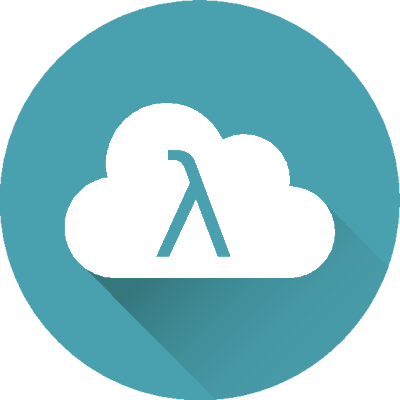

# 

TODO / roadmap: 

- ~~Get everything to build again, ideally directly from cyclone~~
- ~~view integration with templates~~
- support index pages. Should have a top-level index, and should also have "index" route in a controller that will be routed to if an empty route is specified for the controller (EG: "/demo2/" or "/demo2")
- make a working demo and have it do something interesting
- provide basic project description,
- installation/build instructions 
- include an arch linux script for getting packages?
- and usage
- first need to get controllers working (think we are there?) and build a demo REST API
- then get models working at some level (maybe postgres integration?)
- then figure out views for a UI (would be sweet to have a demo using React or such)
- Deployment. It may not make sense to deploy the whole tree, do we have a convenience way to package up the app/content/views for deploying a site?

# Installation

TODO: build and run example from github action, including http server hosting the fcgi app

# Install Dependencies

## Ubuntu

    sudo apt-get install libfcgi-dev spawn-fcgi

Right now we are using nginx instead, but this would be nice to figure out, too:
(lighthttpd setup https://www.linuxcloudvps.com/blog/how-to-install-lighttpd-on-ubuntu-18-04/ )

## Arch Linux

    pacman -Sy
    pacman -S pacman
    pacman -S nginx fcgi fcgiwrap spawn-fcgi

